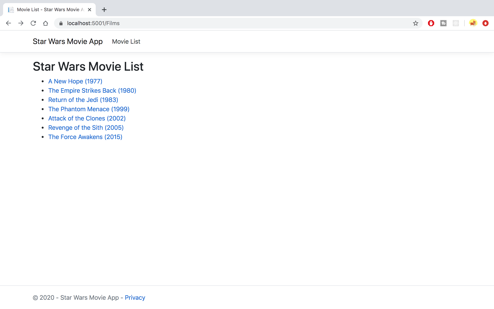
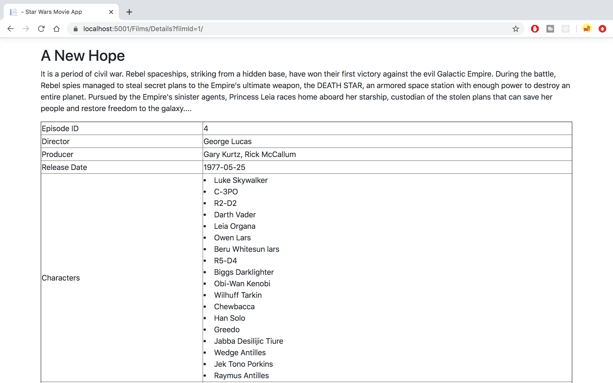
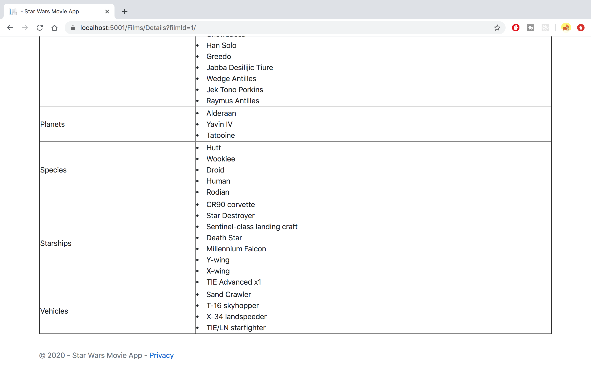

# Star Wars App

This is a web application that displays the list of Star Wars movies and related data.
This application was built using [Star Wars API](https://swapi.com/) and the helper library called [SWapi-CSharp](https://github.com/M-Yankov/SWapi-CSharp).

Please refer to:
* [Controller](Controllers/FilmsController.cs)
* [MovieListView](Views/Films/Index.cshtml)
* [MovieDetailBiew](Views/Films/Details.cshtml)

to see my coding.

Q1: Assuming the Star Wars API was slow, what are some optimizations that could be implemented to improve the user experience?
A1: 
1) Cache the data from HTTP requests so it doesn't have redundant calls.
2) Only request the data needed instead of receiving entire package of data. (E.g. Receive name only from Species instead of all fields of data.)
2) Use asynchronous methods to load the available data first while waiting for other data.

Q2: Any improvements you would make to your application?
A2: 
1) Use form submit to not display the filmId on the url link.
2) Add the back button to return to the move list page from move details page. Currently you can access to the move list page by clicking header.

Thanks!

### Screenshots

